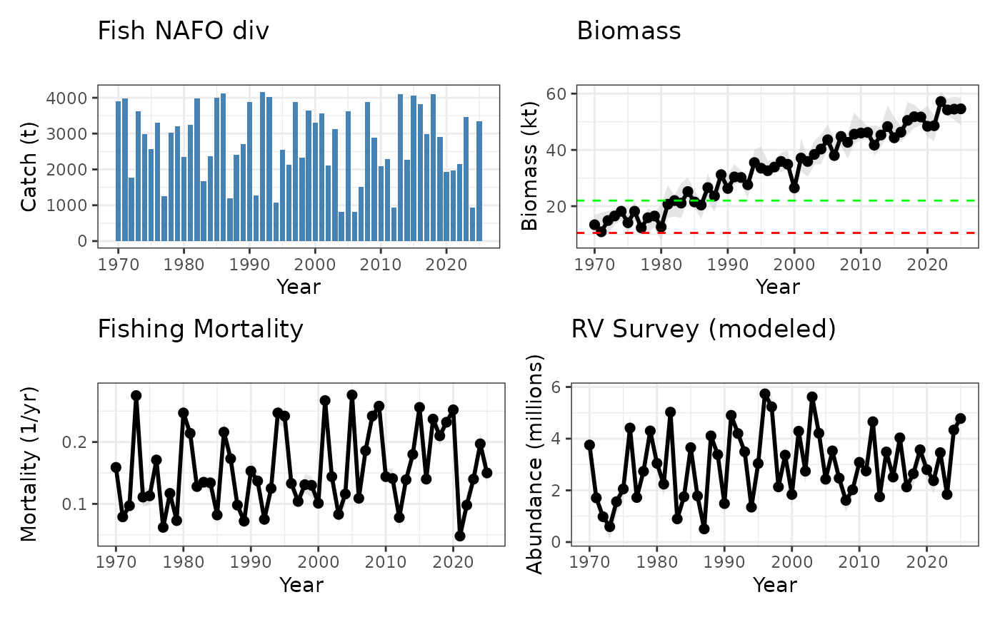

# Fisheries Science Advisory Report (FSAR) four panel plot example in marea

## Using `marea` to develop FSAR plots

### Introduction

Fisheries Science Advisory Reports
([FSAR](https://www.dfo-mpo.gc.ca/science/species-especes/fisheries-halieutiques/stockassessment-evaluationstock/index-eng.html))
are provided through the Canadian Science Advisory Secretariat and help
decision makers understand information about a particular fish stock
through stock assessments.

Stock assessments are the scientific process of analyzing available data
to evaluate the abundance, productivity, and options for harvest levels
of fish stocks in the past, present, and future.

### Example of FSAR dataset

Here we create some example FSAR data:

``` r
library(tidyverse)
library(marea)

set.seed(42)

years <- 1970:2025

# Catch: Range ~ 800 to 4200
catch_value <- round(runif(length(years), 800, 4200), 1)

# Biomass: Values rising slowly over years, with uncertainty
biomass_value <- round(seq(12, 55, length.out = length(years)) + rnorm(length(years), 0, 3), 1)
biomass_lower <- round(biomass_value - runif(length(years), 1.2, 6), 1)
biomass_upper <- round(biomass_value + runif(length(years), 1.3, 8), 1)

# Fishing: Rates around 0.06–0.27, with some noise
fishing_value <- round(runif(length(years), 0.06, 0.27) + rnorm(length(years), 0, 0.01), 3)
fishing_lower <- round(fishing_value - runif(length(years), 0.005, 0.02), 3)
fishing_upper <- round(fishing_value + runif(length(years), 0.005, 0.02), 3)

# Recruitment: Generally <1 to ~5, with years of high recruitment and uncertainty
recruitment_value <- round(runif(length(years), 0.8, 5.3) + rnorm(length(years), 0, 0.5), 3)
recruitment_lower <- round(recruitment_value - runif(length(years), 0.08, 0.5), 3)
recruitment_upper <- round(recruitment_value + runif(length(years), 0.08, 0.5), 3)

fsar_fourplot_exdata <- data.frame(
  panel.category = rep(c("Catch", "Biomass", "Fishing", "Recruitment"), each = length(years)),
  year = rep(years, 4),
  ts.name = c(
    rep("CanadaTotal", length(years)),
    rep("Survey", length(years)),
    rep("Ut", length(years)),
    rep("RVpred", length(years))
  ),
  value = c(catch_value, biomass_value, fishing_value, recruitment_value),
  lower = c(
    rep(NA, length(years)),
    biomass_lower,
    fishing_lower,
    recruitment_lower
  ),
  upper = c(
    rep(NA, length(years)),
    biomass_upper,
    fishing_upper,
    recruitment_upper
  )
)
```

### Create `ea_data` object

Using `ea_data` allows for storage of rich metadata alongside the time
series dataset. Required metadata include: *x (data), value_col,
data_type, location_descriptor, region, units, and source citation*.
However, you can add additional metadata as desired.

``` r
fsar_example <- as_ea_data(
  x = fsar_fourplot_exdata,
  value_col = "value",
  data_type = "stock",
  location_descriptor = "NAFO divisions",
  region = "Maritimes",
  units = "variable",
  source_citation = "DFO FSAR 2025 citation",
  # additional metadata
  assessment_lead = "Fishy McFishface",
  notes = "any caveats in this dataset like missing years or changes to assessment models"
)
```

### Make individual plots

Individual plots can easily be constructed using `marea` plotting
functions with varying style arguments. You can use `@` operator to
access the `ea_data` data slot and filter data using `$` operator. This
can be easily embedded in the plot function. Since the plots are
`ggplot2` objects, extra layers can be added to customize the plots.

``` r
# Fishing mortality
pF <- plot(fsar_example[
  fsar_example@data$panel.category == "Fishing" & fsar_example@data$ts.name == "Ut"
], style = "ribbon") +
  labs(title = "Fishing Mortality", y = "Mortality (1/yr)", subtitle = "")

# Biomass with additional Reference Points
pbiomass <- plot(fsar_example[
  fsar_example@data$panel.category == "Biomass" & fsar_example@data$ts.name == "Survey"
], style = "ribbon") +
  labs(title = "Biomass", y = "Biomass (kt)", subtitle = "") +
  geom_hline(yintercept = 10.5, color = "red", linetype = "dashed") +
  geom_hline(yintercept = 22, color = "green", linetype = "dashed")

# Catches
pcatch <- plot(fsar_example[
  fsar_example@data$panel.category == "Catch" & fsar_example@data$ts.name == "CanadaTotal"
], style = "histogram") +
  labs(title = "Fish NAFO div", y = "Catch (t)", subtitle = "")

# Recruitment
pabun <- plot(fsar_example[
  fsar_example@data$panel.category == "Recruitment" & fsar_example@data$ts.name == "RVpred"
], style = "ribbon") +
  labs(title = "RV Survey (modeled)", y = "Abundance (millions)", subtitle = "")
```

### Easily combine plots

It is easy to make a four plot commonly used in FSARs using `patchwork`:

``` r
library(patchwork)
(pcatch + pbiomass) / (pF + pabun)
```



### Learn More Basics

- The main
  [README](https://marecosystemapproaches.github.io/marea/README.md) has
  a quick start

------------------------------------------------------------------------

### Citing `marea`

Please cite the package in your work. For citation text:

    ## To cite marea in publications use:
    ## 
    ##   Jamie C. Tam, Benoit Casault, Stephanie Clay et al. (). marea:
    ##   Maritime Ecosystem Approach R Package. R package version 1.0.0.9000.
    ##   https://doi.org/10.5281/zenodo.15706086
    ## 
    ## A BibTeX entry for LaTeX users is
    ## 
    ##   @Manual{,
    ##     title = {marea: Maritime Ecosystem Approach R Package},
    ##     author = {Jamie C. Tam and Benoit Casault and Stephanie Clay and Adam Cook and Remi Daigle and Andrew M. Edwards and Jaimie Harbin and Brad Hubley and Keith David and Mike McMahon and Emily A. O'Grady},
    ##     note = {R package version 1.0.0.9000},
    ##     url = {https://github.com/MarEcosystemApproaches/marea},
    ##     doi = {10.5281/zenodo.15706086},
    ##   }
    ## 
    ## We appreciate citations as they help us secure funding for continued
    ## development.

------------------------------------------------------------------------

*This vignette was generated using the `marea` source code
(2025-10-09).*

------------------------------------------------------------------------
